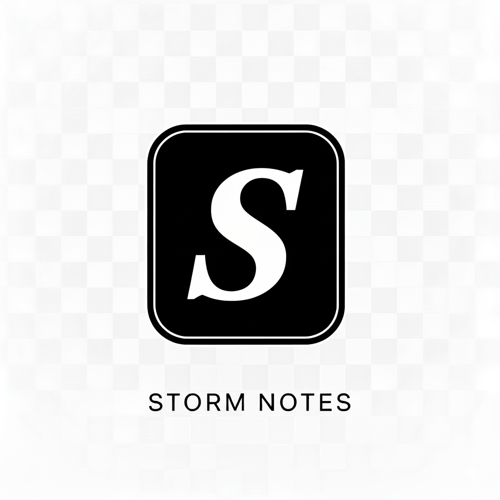

# Storm Notes ⚡

<div align="center">
  
  
  **An intelligent productivity suite powered by Google Gemini AI**
  
  [](https://nextjs.org/)
  [](https://reactjs.org/)
  [](https://www.typescriptlang.org/)
  [](https://tailwindcss.com/)
</div>

## 🚀 Features

### 🎨 Content Generation Module
- **AI-Powered Content Creation** - Generate text, images, and multimedia content using Gemini AI
- **Creative Writing Assistant** - Professional document creation and creative storytelling
- **Multi-format Export** - Export content in various formats for different use cases

### ⏰ Productivity Suite
- **Smart Timezone Management** - Real-time timezone cards with live clock updates
- **Time Conversion Tools** - Seamless time conversion for global collaboration
- **Email Reminder Scheduling** - AI-powered reminder system with timezone awareness
- **Contact Management** - Intelligent contact organization with AI-enhanced search
- **Document Analysis** - Automated document processing and workflow integration

### 🔐 Authentication & Security
- **Secure Authentication** - Clerk integration for robust user management
- **Protected Routes** - Secure access to sensitive features
- **Session Management** - Persistent user sessions with automatic authentication flow

### 🎯 Modern User Experience
- **Interactive Carousel** - Engaging homepage with auto-play feature showcase
- **Responsive Design** - Mobile-first design that works across all devices
- **Dark Theme UI** - Modern interface with gradient accents and smooth animations
- **Real-time Updates** - Live data updates and instant feedback

## 🛠️ Technology Stack

### Frontend
- **Next.js 15** - React framework with App Router for modern web development
- **React 19** - Latest React features with concurrent rendering
- **TypeScript** - Type-safe development with enhanced developer experience
- **Tailwind CSS** - Utility-first CSS framework for rapid UI development

### Authentication
- **Clerk** - Complete authentication solution with user management
- **Protected Routes** - Secure access control for sensitive features

### AI Integration
- **Google Gemini API** - Advanced AI capabilities for content generation and analysis
- **@google/genai** - Official Google Generative AI SDK

### Email Services
- **Resend API** - Reliable email delivery for notifications and reminders

### UI Components
- **Lucide React** - Beautiful, customizable icons
- **Custom Components** - Reusable UI components with consistent design

### Development Tools
- **ESLint** - Code linting for consistent code quality
- **PostCSS** - CSS processing and optimization

## 📦 Installation

### Prerequisites
- **Node.js** (v18 or higher)
- **npm** or **yarn**
- **Gemini API Key** from Google AI Studio
- **Clerk Account** for authentication
- **Resend Account** for email services

### Setup Instructions

1. **Clone the repository**
   ```bash
   git clone <repository-url>
   cd StormNotesV1
   ```

2. **Install dependencies**
   ```bash
   npm install
   ```

3. **Environment Configuration**
   
   Copy the example environment file:
   ```bash
   cp .env.example .env.local
   ```
   
   Configure your environment variables in `.env.local`:
   ```env
   # Gemini AI Configuration
   GEMINI_API_KEY=your_gemini_api_key_here
   
   # Clerk Authentication
   NEXT_PUBLIC_CLERK_PUBLISHABLE_KEY=your_clerk_publishable_key
   CLERK_SECRET_KEY=your_clerk_secret_key
   
   # Resend Email Service (Optional)
   RESEND_API_KEY=your_resend_api_key
   ```

4. **Run the development server**
   ```bash
   npm run dev
   ```

5. **Open your browser**
   
   Navigate to [http://localhost:3000](http://localhost:3000) to see the application.

## 🚀 Getting Started

### First Time Setup

1. **Sign Up/Sign In** - Create an account or sign in using the authentication buttons
2. **Explore Features** - Use the "Get Started" button to access the module selection modal
3. **Choose Your Module**:
   - **Content Generator** - For AI-powered content creation
   - **Productivity Suite** - For time management and workflow tools

### Key Workflows

#### Setting Up Timezone Cards
1. Navigate to the Productivity Suite
2. Add timezone cards for locations you work with
3. View real-time clocks and manage global schedules

#### Creating Content
1. Access the Content Generator module
2. Select your content type (text, image, etc.)
3. Let Gemini AI assist with creation and refinement

#### Scheduling Reminders
1. Go to the Reminders section in Productivity Suite
2. Set your reminder message and recipient email
3. Choose date/time (minimum 1 minute in future) and timezone
4. AI calculates optimal delivery timing

## 📁 Project Structure

```
StormNotesV1/
├── app/                    # Next.js App Router pages
├── components/             # Reusable React components
│   ├── HeroCarousel.tsx   # Homepage carousel component
│   ├── FeatureCards.tsx   # Feature showcase cards
│   ├── TopNavBar.tsx      # Navigation with authentication
│   └── ...
├── services/              # API service layers
│   ├── geminiService.ts   # Gemini AI integration
│   ├── resendService.ts   # Email service integration
│   └── apiService.ts      # General API utilities
├── hooks/                 # Custom React hooks
├── public/                # Static assets
├── types.ts              # TypeScript type definitions
└── ...
```

## 🔧 Available Scripts

- `npm run dev` - Start development server
- `npm run build` - Build for production
- `npm run start` - Start production server
- `npm run lint` - Run ESLint for code quality

## 🌟 Key Features Deep Dive

### AI-Powered Intelligence
Storm Notes leverages Google's Gemini AI to provide intelligent assistance across all features, from content generation to time calculations and workflow optimization.

### Real-Time Collaboration
Built for global teams with timezone-aware features, real-time updates, and seamless communication tools.

### Security First
Implements modern authentication patterns with Clerk, ensuring user data security and privacy protection.

### Developer Experience
Built with modern development practices, comprehensive TypeScript support, and maintainable architecture.

## 🤝 Contributing

1. Fork the repository
2. Create a feature branch (`git checkout -b feature/amazing-feature`)
3. Commit your changes (`git commit -m 'Add amazing feature'`)
4. Push to the branch (`git push origin feature/amazing-feature`)
5. Open a Pull Request

## 📄 License

This project is licensed under the MIT License - see the [LICENSE](LICENSE) file for details.

## 🆘 Support

For support and questions:
- Check the [Issues](../../issues) page
- Review the [Project Report](Implementations/Reports/ProjectReport.MD) for detailed documentation
- Contact the development team

---

<div align="center">
  <strong>Built with ❤️ using Next.js, React, and Google Gemini AI</strong>
</div>
